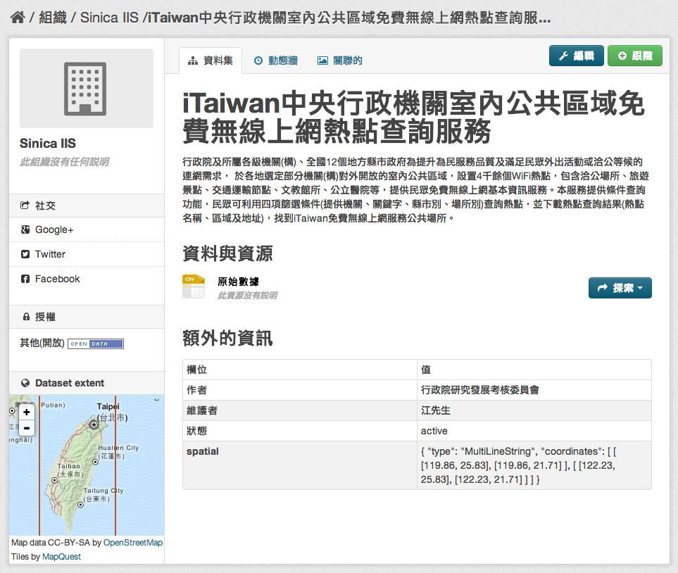
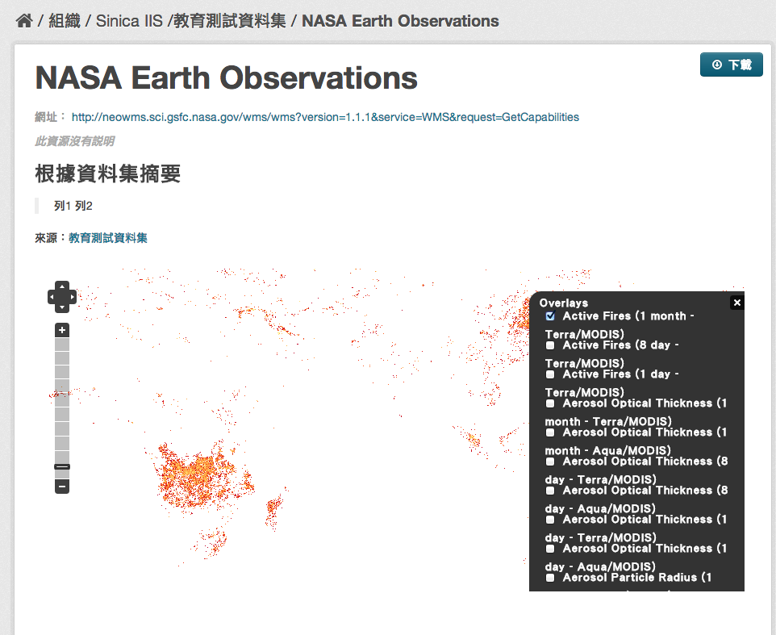

ckanext-spatial
================

ckanext-spatial 是一個 ckan 的延伸套件 (extension)，提供地理資訊相關功能。

詳細介紹可以參考 `ckanext-spatial 的官方 github <https://github.com/okfn/ckanext-spatial>`_ 。

外掛主要功能簡介                                                                                                               
-----------------                                                                                                              
                                                                                                                               
spatial_metadata                                                                                                               
^^^^^^^^^^^^^^^^^^                                                                                                             
建立地理空間資訊之索引。                                                                                                       
                                                                                                                               
Spatial Search Widget                                                                                                          
^^^^^^^^^^^^^^^^^^^^^^                                                                                                         
按地圖搜尋資料集 "spatial" 欄位的地理空間資訊，僅支援 solr 3.1+。安裝完成後，即可在資料集清單顯示頁面的左下角看到 "Filter by location" 的區塊，此區塊並可放大後，依照使用者選取的地理區域篩選出符合的資料集。
                                                                                                                               
欲使用此功能，請在 ckan.plugins 加入 spatial_metadata 與 spatial_query。                                                       
                                                                                                                  
Dataset Extent Map                                                                                                             
^^^^^^^^^^^^^^^^^^^                                                                                                            
以地圖顯示資料集 "spatial" 欄位所述之地理空間資訊 (僅支援 geojson 格式)。如下圖所示，在「額外的資訊」中填寫的 spatial geojson 資訊，將顯示在左下角的 Dataset extent 中。

欲使用此功能，請在 ckan.plugins 加入 spatial_metadata。                                                                        
                                                                                                                               

WMS Preview                                                                                                                    
^^^^^^^^^^^^                                                                                                                   
此功能可以地圖方式呈現 wms 服務所涵括的地理範圍 (GetCapabilities)，並可切換圖層。

欲使用此功能，請在 ckan.plugins 加入 wms_preview。                                                                             
                                                                                                                               
以 `NASA Earth Observations <http://neowms.sci.gsfc.nasa.gov/wms/wms?version=1.1.1&service=WMS&request=GetCapabilities>`_ 為例：                                                                                                                             
                                                                                                                               

                                                                                                                               
GeoJSON Preview                                                                                                                
^^^^^^^^^^^^^^^^^                                                                                                              
以地圖檢視 GeoJSON 檔案（ckan 內建之 preview 僅支援以樹狀結構顯示 json 格式文件）。支援 ``geojson`` 與 ``gjosn`` 兩種檔案格式名稱定義。                                                                                                                               
欲使用此功能，請在 ckan.plugins 加入 geojson_preview 與 resource_proxy。                                                       
                                                                                                                               
CSW Server                                                                                                                     
^^^^^^^^^^^                                                                                                                    
提供 CSW 服務介面。                                                                                                  
                                                                                                                               
.. _spatial-harvesters:                                                                                                        

Spatial Harvesters                                                                                                             
^^^^^^^^^^^^^^^^^^^                                                                                                            
提供地理空間相關的 harvesters，可以將 CSW, WAF, spatial metadata document 等資料目錄來源的後設資料擷取下來並匯入 ckan 之中。須注意的是，資料本身仍然位於原資料目錄之網站。此 harvester 係實作 ckanext-harvest 套件之 harvester interface。

欲使用此功能，請安裝 `ckanext-harvest 外掛 <https://github.com/okfn/ckanext-harvest>`_ 並在 ckan.plugins 加入 csw_harvester, doc_harvester 與 waf_harvester。

.. note::

   * 若您有成功安裝 ckanext-spatial 套件並啟用上述三個 plugins，應該可以看到 "CKAN, CSW Server, Web Accessible Folder (WAF), Single spatial metadata document" 四種 source 類別

   * ckanext-spatial 提供的 havester 現階段 (0.2) 並不穩定，匯入大量資料很緩慢（實測 11,400 筆左右需時 3 小時），且容易因 source 缺少某些欄位值或 source 資料格式與 harvester（及其相依的 python library）不符而引發 python exception。

   * 實測結果，CSW 可能會有問題（見下方說明）、WAF 可以運作（但資料需符合 ISO 19139 規範）。

其使用方式與一般 ckan harvester 相同，請參考 :doc:`ckanext-harvest`

* TGOS（國土資訊圖資服務平台）CSW source harvesting 經驗：

  嘗試將 TGOS 提供之 `CSW 服務 <http://tgos.nat.gov.tw/tgos/Web/TGOS_Home.aspx>`_ ，透過 spatial harvester 匯入 ckan，結果會發生 list out of range exception。

  原因是 spatial harvester 使用的 `OWSLib <http://geopython.github.io/OWSLib/>`_ 這個 python library 判斷 csw source 的 xml tag ``gmd:identificationInfo`` 時，認定其下只有一個子 tag ``MD_DataIdentification`` ， 但 TGOS 有部份的資料卻有兩個 ``MD_DataIdentification`` （ `如此例 <http://tgos.nat.gov.tw/tgos/Web/Metadata/TGOS_MetaData_View.aspx?MID=4229&SHOW_BACK_BUTTON=false&keyword=TW-09-371020000A-000001>`_ ） ，因此造成 python 錯誤。 

  原先懷疑是 TGOS 不符合 ISO19139 規範，但基本上 ISO 應無要求 tag 的數量只能有一個。

  所以 TGOS 匯入 CSW 失敗，既不是 ckanext-spatial 套件本身的問題，也不是 TGOS csw 不符合 ISO19139 規範，其實是 OWSLib 的問題。此問題可以藉由簡單修改 OWSLib 原始碼解決。

  打開 ``/usr/lib/ckan/default/local/lib/python2.7/site-packages/owslib/iso.py`` ，搜尋 ``'gmd:identificationInfo'`` ，將：

  .. code-block:: python

     for idinfo in md.findall(util.nspath_eval('gmd:identificationInfo', namespaces)):

  修改為：

  .. code-block:: python

     for idinfo in list(md.findall(util.nspath_eval('gmd:identificationInfo', namespaces)))[0]:

  即可。

  由於 ISO19139 對資料格式的規範並不是非常的嚴謹，今後匯入 CSW 時，仍需 case by case 作調整。

  PS. TGOS 有 36,000 個資料集，一次性抓下來需要一天 

系統需求
---------
* Python (2 or 3) 安裝於 virtualenv
* ckan (>=1.8)
* solr (>=3.1)
* `ckanext-harvest <https://github.com/okfn/ckanext-harvest>`_ (ckan 延伸套件)：外掛 :ref:`spatial-harvesters` 需要

.. note::

   * 若依照本文件的教學安裝 ckan，你應該已經擁有上述前三套套件
   * Dataset Extent Map 與 Spatial Search Widget 兩個 snippets 需要 ckan>=2.0

安裝
-----
a. 安裝 ckanext-spatial 套件：

   .. code-block:: bash

      (pyenv) $ pip install -e git+https://github.com/okfn/ckanext-spatial.git@release-v2.0#egg=ckanext-spatial

   .. note::

      release-v2.0 請自行依 ckan 版本替換之

b. 安裝其他需要的 Python 套件：

   .. code-block:: bash

      (pyenv) $ pip install -r pip-requirements.txt

c. 安裝 PostGIS：

   請直接參考 `官方的安裝說明 <http://docs.ckan.org/projects/ckanext-spatial/en/latest/install.html#install-postgis-and-system-packages>`_ 。

d. 修改 ckan 設定檔：

   打開 ckan 設定檔（一般位於 /etc/ckan/default/），並加入：

   .. code-block:: python
      
      ckanext.spatial.search_backend = solr

   並修改 ckan.plugins 參數，增加需要的外掛（參見下文介紹）。

e. 修改 solr schema：

   打開 solr schema（一般位於 /usr/share/solr/collection1/conf/solrconfig.xml），找到 <fields> 區段，加上：

   .. code-block:: xml
      
      <fields>
          <!-- ... -->
          <field name="bbox_area" type="float" indexed="true" stored="true" />
          <field name="maxx" type="float" indexed="true" stored="true" />
          <field name="maxy" type="float" indexed="true" stored="true" />
          <field name="minx" type="float" indexed="true" stored="true" />
          <field name="miny" type="float" indexed="true" stored="true" />
      </fields>

f. 新增 Spatial Search Widget：

   打開 cakn source 目錄下的 ./ckan/templates/package/search.html，在  段落中加入

   .. code-block:: python

      

g. 新增 Dataset Extent Map (widget)：

   打開 cakn source 目錄下的 ./ckan/templates/package/read.html，在最後加入

   .. code-block:: python

      
        {{ super() }}

        
        
          
        

      
